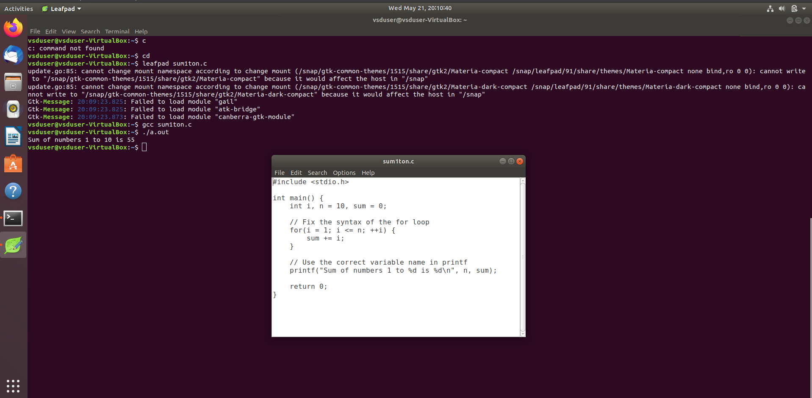

# VSD Squadron

The VSDSquadron Mini is a versatile powerhouse within the RISC-V landscape, designed to elevate your development experience to new heights.
Whether you're a newcomer exploring embedded systems or an experienced developer building advanced devices, the VSDSquadron Mini serves as the ideal companion.

It seamlessly bridges the gap between theory and practical application, featuring an on-board flash programmer with a single-wire programming protocol.
This makes it perfect for educational projects and development workflows, enabling you to start building with proficiency and ease.
The instructor for this internship is **Kunal Ghosh Sir**.

---

## Basic Details

- **Name:** Thaareesh R 
- **College:** Amrita Vishwa Vidhyapeetham
- **Email ID:** art04adp@gmail.com  

---

## Tasks

- [Task 1: Tool Installation](#task-1-tool-installation)
<!-- You can add more tasks here as you progress -->

---

## Task 1: Tool Installation

The objective of **Task 1** is to install all the essential tools required for this internship. These include:

- Ubuntu on VirtualBox  
- GNU Toolchain  
- Running C code for displaying sum 1 to n.

### 📸 Screenshot

 <!-- Update the image filename if needed -->
