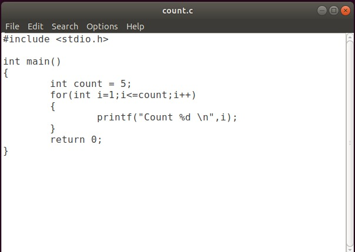
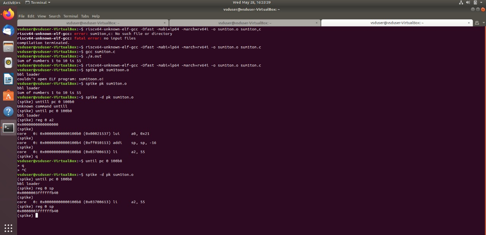
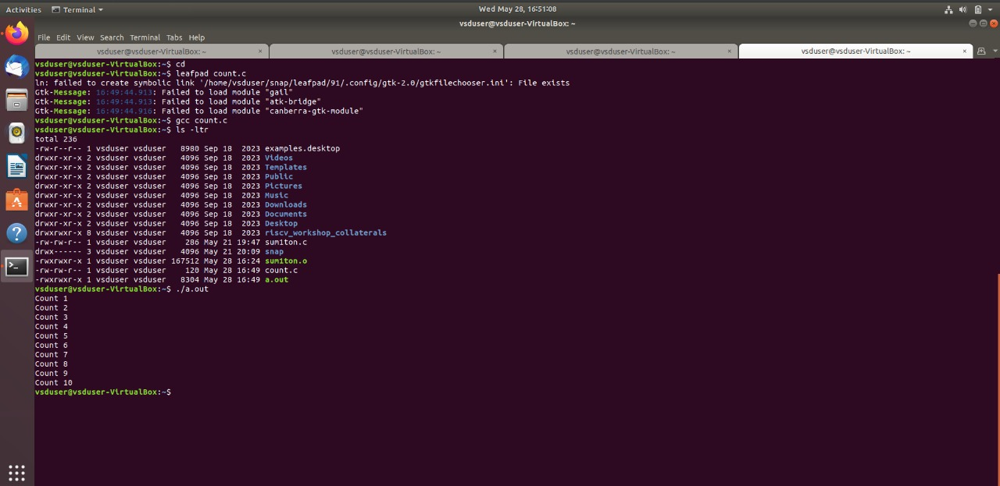
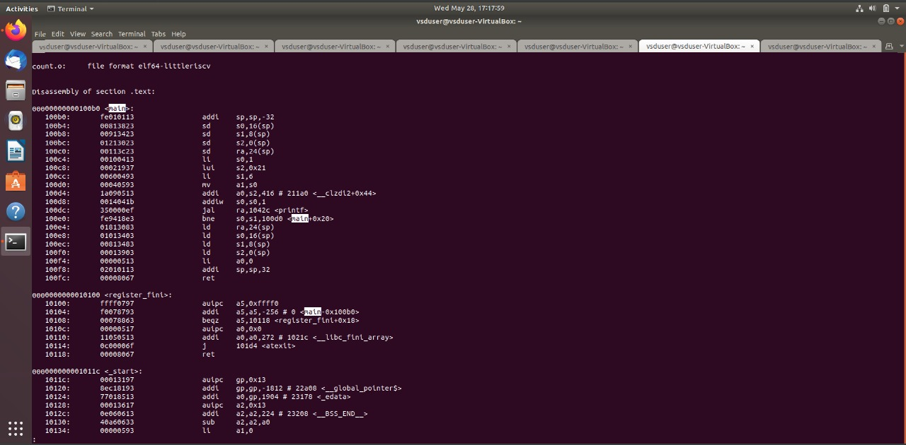
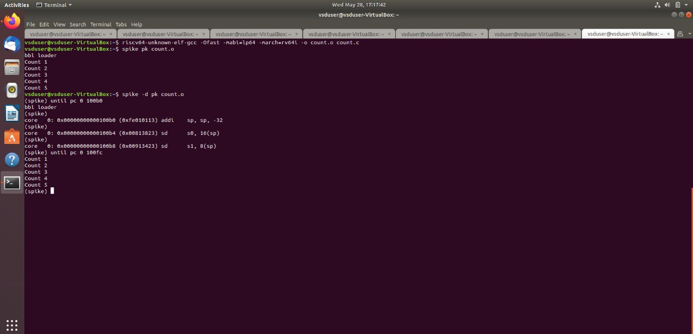

# VSD Squadron

The **VSDSquadron Mini** is a versatile powerhouse within the **RISC-V landscape**, designed to elevate your development experience to new heights.  
Whether you're a **newcomer exploring embedded systems** or an **experienced developer building advanced devices**, the VSDSquadron Mini serves as the ideal companion.

It seamlessly bridges the gap between **theory and practical application**, featuring an **on-board flash programmer** with a **single-wire programming protocol**.  
This makes it perfect for **educational projects** and **development workflows**, enabling you to start building with proficiency and ease.  
The instructor for this internship is **Kunal Ghosh Sir**.

---

## Basic Details

- **Name:** Thaareesh R  
- **College:** Amrita Vishwa Vidhyapeetham  
- **Email ID:** art04adp@gmail.com  

---

## Tasks

<details>
  <summary><strong>Task 1: Tool Installation</strong></summary>

  <br>

  The objective of **Task 1** is to install all the essential tools required for this internship. These include:

  - Ubuntu on VirtualBox  
  - GNU Toolchain  
  - Running C code for displaying sum 1 to n.

  ### 📸 Screenshot

  

  C file is then converted to RISC-V Binary
  
  
</details>
<details>
  <summary><strong>Task 2: Performing SPIKE Simulation and Debugging the C Code Using Spike</strong></summary>

  <br>

  ### 🧠 What is Spike?

  **Spike** is the official simulator for the **RISC-V Instruction Set Architecture (ISA)**.  
  It provides a virtual environment for executing RISC-V programs, which is extremely useful for testing, debugging, and learning how RISC-V processors work under the hood.

  Developers use Spike to simulate compiled programs, analyze instruction execution, and ensure their software behaves correctly before deploying it to hardware.

  To compile C programs for RISC-V, we use the **GNU Compiler Collection (GCC)** configured for RISC-V targets. Once compiled, the binaries can be run and debugged in Spike.

  ---

  ### 🧪 Running a RISC-V Program in Spike

  After compiling the C file using `riscv64-unknown-elf-gcc`, we run the output binary on Spike using:

  ```bash
  spike pk sum1ton.o
  ```
**APPLICATION**
  <summary><strong>🚀 Application: Simple Counting Program (1 to 5)</strong></summary>

  <br>

  This C program demonstrates a basic count-up logic from **1 to a specified number**.

  ### 🎯 Objective:
  - Initialize a variable with a final count value (e.g., 5)
  - Use a `for` loop to iterate from 1 to the given value
  - Print each count during the loop
  - Exit the program once the count is complete

  ### 💻 C Code:
  ```c
  #include <stdio.h>

  int main() {
      int count = 5;
      for (int i = 1; i <= count; i++) {
          printf("Count %d\n", i);
      }
      return 0;
  }
```
Count 1 to 10

Output of C code is:
  
Complication using gcc
  
Assembly Language program for the above C code:
  
Debugging all the instructions in the Assembly language program using spike
  
</details>
