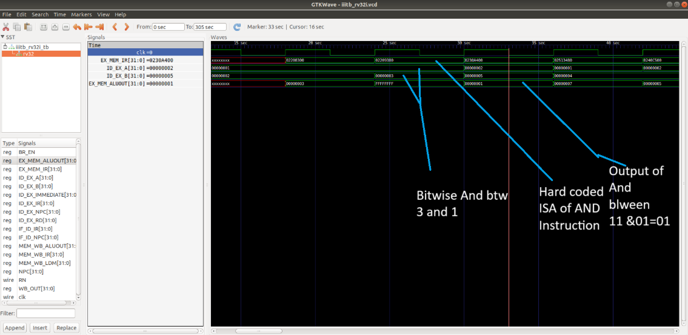

# VSD Squadron

The **VSDSquadron Mini** is a versatile powerhouse within the **RISC-V landscape**, designed to elevate your development experience to new heights.  
Whether you're a **newcomer exploring embedded systems** or an **experienced developer building advanced devices**, the VSDSquadron Mini serves as the ideal companion.

It seamlessly bridges the gap between **theory and practical application**, featuring an **on-board flash programmer** with a **single-wire programming protocol**.  
This makes it perfect for **educational projects** and **development workflows**, enabling you to start building with proficiency and ease.  
The instructor for this internship is **Kunal Ghosh Sir**.

---

## Basic Details

- **Name:** Thaareesh R  
- **College:** Amrita Vishwa Vidhyapeetham  
- **Email ID:** art04adp@gmail.com  

---

## Tasks

<details>
  <summary><strong>Task 1: Tool Installation</strong></summary>

  <br>

  The objective of **Task 1** is to install all the essential tools required for this internship. These include:

  - Ubuntu on VirtualBox  
  - GNU Toolchain  
  - Running C code for displaying sum 1 to n.

  ### 📸 Screenshot

  

  C file is then converted to RISC-V Binary
  
  
</details>
<details>
  <summary><strong>Task 2: Performing SPIKE Simulation and Debugging the C Code Using Spike</strong></summary>

  <br>

  ### 🧠 What is Spike?

  **Spike** is the official simulator for the **RISC-V Instruction Set Architecture (ISA)**.  
  It provides a virtual environment for executing RISC-V programs, which is extremely useful for testing, debugging, and learning how RISC-V processors work under the hood.

  Developers use Spike to simulate compiled programs, analyze instruction execution, and ensure their software behaves correctly before deploying it to hardware.

  To compile C programs for RISC-V, we use the **GNU Compiler Collection (GCC)** configured for RISC-V targets. Once compiled, the binaries can be run and debugged in Spike.

  ---

  ### 🧪 Running a RISC-V Program in Spike

  After compiling the C file using `riscv64-unknown-elf-gcc`, we run the output binary on Spike using:

  ```bash
  spike pk sum1ton.o
  ```
**APPLICATION**
  <summary><strong>🚀 Application: Simple Counting Program (1 to 5)</strong></summary>

  <br>

  This C program demonstrates a basic count-up logic from **1 to a specified number**.

  ### 🎯 Objective:
  - Initialize a variable with a final count value (e.g., 5)
  - Use a `for` loop to iterate from 1 to the given value
  - Print each count during the loop
  - Exit the program once the count is complete

  ### 💻 C Code:
  ```c
  #include <stdio.h>

  int main() {
      int count = 5;
      for (int i = 1; i <= count; i++) {
          printf("Count %d\n", i);
      }
      return 0;
  }
```
Count 1 to 10
<br>

<br>
Output of C code is:
  
<br>
Complication using gcc
  
  <br>
Assembly Language program for the above C code:
  
  <br>
Debugging all the instructions in the Assembly language program using spike
  
</details>
<details>
<summary><b>Task 3:</b> Various RISCV instruction type and 32 bit instruction code for instructions from application code  </summary>   
<br>

RISCV Instruction types
--

There are 6 types of instruction types in RISCV ISA
 1.  R-Type (Register Type)
 2.  I-Type (Immediate Type)
 3.  S-Type (Store Type)
 4.  U-Type (Branch Type)
 5.  B-Type (Upper Immediate Type)
 6.  J-Type (Jump Type)

In the base RV32I ISA, there are four core instruction formats (R/I/S/U), as shown in Base instruction formats. All are a fixed 32 bits in length.


1.R-Type:
--
  This diagram represents the R-Type instruction format in the RISC-V Instruction Set       
    Architecture (ISA). R-Type instructions are typically used for register-to-register operations

1. Opcode (bits 6-0):

   The 7-bit opcode identifies the type of operation and the instruction format. For R-Type instructions, the opcode specifies that the instruction is register-based.

2. rd( bits 11:7):
   This bit is used for designation register where the output of the operation is written.
3. funct3( bits 14:12) :
   This 3 bit is used for differentiate between categories of operations within the same opcode.
   R type operations:
   
| **funct3** | **Operation**                      |
|------------|------------------------------------|
| `000`      | Add / Sub (depends on `funct7`)   |
| `001`      | Shift Left Logical (SLL)          |
| `010`      | Set Less Than (SLT)               |
| `011`      | Set Less Than Unsigned (SLTU)     |
| `100`      | XOR                               |
| `101`      | Shift Right (Logical/Arithmetic; depends on `funct7`) |
| `110`      | OR                                |
| `111`      | AND                               |

4. rs1(bits 19:15) :
 It specifies the first source register for the operation.
5. rs2(bits 24:20) :
 It specifies the second source register for the operation.
6. funct7(bits 31:25) :
 It provides additional differentiation between instructions that use the same opcode and fuct3.

Examples for R Type operation.  

| **funct7**  | **funct3** | **Operation**                        |
|-------------|------------|--------------------------------------|
| `0000000`   | `000`      | Add                                 |
| `0100000`   | `000`      | Sub                                 |
| `0000000`   | `001`      | Shift Left Logical (SLL)            |
| `0000000`   | `010`      | Set Less Than (SLT)                 |
| `0000000`   | `011`      | Set Less Than Unsigned (SLTU)       |
| `0000000`   | `100`      | XOR                                 |
| `0000000`   | `101`      | Shift Right Logical (SRL)           |
| `0100000`   | `101`      | Shift Right Arithmetic (SRA)        |
| `0000000`   | `110`      | OR                                  |
| `0000000`   | `111`      | AND                                 |

2.I-Type :
--

I-Type instructions are used for operations involving immediate values, such as arithmetic with constants, memory access (e.g., loads), and control flow (e.g., jumps).

Breakdown of the Fields:
-
1. opcode( bits 6:0) :
 This 7 bits are used to identify the general operation type 
 
2. rd (bits 11:7) :
 It specifies the Destination register which is used to store the result of operation

3. funct3(bits 14:12) :
 It specifies the operation to perform such as load , immediate arthematic etc.,

4. rs1 (bits 19 :15 ) :
specifies the source register for the operation. For example, it provides the base address for memory instructions or a source operand for arithmetic operations.

5. imm[11:0] ( bits 31:20) :
 This 12-bit immediate value is sign-extended and used directly as part of the operation.
It serves as a constant operand for immediate operations or an offset for memory access.

Common I -Type instructions :
-
| **Instruction** | **opcode** | **funct3** | **Description**                       |
|-----------------|------------|------------|---------------------------------------|
| `addi`          | `0010011`  | `000`      | Add immediate to register (`rd = rs1 + imm`). |
| `slti`          | `0010011`  | `010`      | Set if less than immediate (signed). |
| `andi`          | `0010011`  | `111`      | Bitwise AND with immediate.          |
| `lw`            | `0000011`  | `010`      | Load word from memory.               |
| `lh`            | `0000011`  | `001`      | Load halfword from memory.           |
| `jalr`          | `1100111`  | `000`      | Jump and link register (indirect jump). |

3.S-Type:
-

 S-Type instructions are primarily used for store operations, where data from a register is stored into memory at a specified address.

1. opcode (bits 6:0) :
 It identifies the general operation

2. imm[4:0] (bits 11:7) :
 Lower 5 bits of the 12-bit immediate (offset)

3. funct3 (bits 14:12) :
 specifies the type of store like word, byte,halfword etc.,

4. rs1 (bits 19 :15 ) :
 specifies the first source register for the operation.

5. rs2 (bits 24:20) :
 specifies the source register containing the value to be stored in memory.

6. imm[11:5] (bits 31:25) :
  Upper 7 bits of the 12-bit immediate (offset).

Common S-Type Instructions
-
| **Instruction** | **opcode**  | **funct3** | **Description**                      |
|-----------------|-------------|------------|--------------------------------------|
| `sw`           | `0100011`   | `010`      | Store Word (32-bit).                |
| `sh`           | `0100011`   | `001`      | Store Halfword (16-bit).            |
| `sb`           | `0100011`   | `000`      | Store Byte (8-bit).                 |

4.U-Type :
-
U-Type format is used for instructions like LUI (Load Upper Immediate) and AUIPC (Add Upper Immediate to PC)

1.opcode(bits 6:0) :
 It identifies the general operation

2.rd(bits 11:7) :
 It specifies the Destination register which is used to store the reult of the operation

3.imm[31:12] (bits 31:12) :
 20-bit immediate value (constant) used in the instruction. It is stored in the upper 20 bits of the target register.

Common U-Type Instrutions:
--
| **Instruction** | **Opcode (Bits 6–0)** | **Description**                                         |
|------------------|-----------------------|---------------------------------------------------------|
| `LUI`            | `0110111`            | Load Upper Immediate                                    |
| `AUIPC`          | `0010111`            | Add Upper Immediate to Program Counter (PC)            |


There are further two variants of the instruction formats (B/J) based on the handling of immediates .

5.B-Type:
-

B-Type instructions enable branching (jumping) to another location in the code, determined by the offset in the instruction.These instructions check specific conditions and branch (jump) to a target address if the condition is satisfied. If the condition is not met, the program continues with the next sequential instruction.

1.opcode(bits 6:0) :
 It identifies the general operation
 
2.imm[11] (bit 7) :
 Represents one of the middle bits of the immediate value.
 
3.imm[4:1] (bits 11:8) :
 Contributes the lower bits of the branch offset.
 
4.funct3 (bits 14:12) :
 specifies the branch condition that determines how the values in the source registers (rs1 and rs2) are compared.
 
5.rs1 (bits 19:15) :
 specifies the first source register for comparision
 
6.rs2 (bits 24:20) :
 specifies the second source register for comparision
 
7.imm[10:5] (bits 30:25) :
 Provides part of the branch offset.
These bits are directly concatenated to the rest of the immediate fields to form the full 12-bit offset.
 
8.imm[12] (bit 31) :
 Determines the sign of the branch offset.
If imm[12] is 1, the offset is negative (indicating a backward branch in memory).
If imm[12] is 0, the offset is positive (indicating a forward branch in memory).


funct3 examples in B-Type:

| **Instruction** | **`funct3` Value** | **Condition**                   |
|------------------|---------------------|----------------------------------|
| `BEQ`           | `000`              | Branch if `rs1 == rs2`.         |
| `BNE`           | `001`              | Branch if `rs1 != rs2`.         |
| `BLT`           | `100`              | Branch if `rs1 < rs2` (signed). |
| `BGE`           | `101`              | Branch if `rs1 >= rs2` (signed).|
| `BLTU`          | `110`              | Branch if `rs1 < rs2` (unsigned).|
| `BGEU`          | `111`              | Branch if `rs1 >= rs2` (unsigned).|

6.J-Type:
-
J-Type instructions are used for unconditional jumps ,these are also  used for control flow, such as implementing function calls or jumping to a specific instruction

1.opcode(bits 6:0) :
 identifies the general operation

2.rd (bits 11:7) :
 Holds the return address (PC + 4), allowing the program to return to this location after completing the jump.

3.imm[19:12] (bits 19:12) :
 Bits 19 through 12 of the immediate value.

4.imm[11] (bit 20) :
 Bit 11 of the intermediate Value

5.imm[10:1] (bits 30:21) :
 Bits 10 through 1 of the immediate value.

6.imm[20] (bit 31) :
 The 21st (MSB) bit of the 21-bit immediate (used for sign extension).

Common J-Type instructions:
-

| **Instruction** | **Opcode (Bits 6–0)** | **Registers** | **Description**                           |
|------------------|-----------------------|---------------|-------------------------------------------|
| `JAL`           | `1101111`            | `rd`          | Jump and Link: Save return address and jump to target address |


## 32-bit instructions from application (counterdown clock):

!

1 . addi sp,sp -32
-
I-Type Instruction

imm[11:0] | rs1 | funct3 | rd | opcode

- *opcode* = 0010011

- *funct3* = 000 (addi)

- *rd* = x2 (sp)

- *rs1* = x2 (sp)

- *imm* = -32 (signed 12-bit: 111111111110)

32 - bit representation:

``11111111111000010 |  000  |   00010 |  0010011``

2.lw a5,12(sp)
-
I-Type Instruction

imm[11:0]  | rs1   | funct3 | rd    | opcode

- *imm[11:0]*	000000001100 (12)

- *rs1*	00010 (sp)

- *funct3*	010 (lw)

- *rd*	01111 (a5)

- *opcode*	0000011

32-bit representation:

``00000000110000010 | 010 | 01111 | 0000011``

3.jal ra,10184
-
J-Type (Jump)

imm[20|10:1|11|19:12] | rd | opcode

- *opcode* = 1101111

- *rd* = x1 (ra)

- *imm* = 10184

- *imm[20]* = 0

- *imm[10:1]* = 1111101000

- *imm[11]* = 1

- *imm[19:12]* = 1100

32-bit representation:

``000000110011001001 | 00001 | 1101111``

4.ld a5,88(a0)
-
I-Type (Load, RV64I)

imm[11:0] | rs1 | funct3 | rd | opcode

- *opcode* = 0000011

- *funct3* = 011 (ld)

- *rd* = x15 (a5)

- *rs1* = x10 (a0)

- *imm* = 88 (000000010110)

32 - bit representation:

``00000001011001010 |011 |   01111 |   0000011``

5.jalr a5
-
I-Type (Jump Register)

imm[11:0] | rs1 | funct3 | rd | opcode

- *opcode* = 1100111

- *funct3* = 000 (jalr)

- *rd* = x15 (a5)

- *rs1* = x15 (a5)

- *imm* = 0

32 - bit-representation:

``00000000000001111 | 000  |   01111  | 1100111``

6.srai s2,s2,0x3
-
I-Type Instruction

imm[11:0] | rs1 | funct3 | rd | opcode

- *imm[11:5]*	0100000

- *imm[4:0]*	00011 (shift amount = 3)

- *rs1*	10010 (s2)

- *funct3*	101 (srai)

- *rd*	10010 (s2)

- *opcode*	0010011

32 - bit representation:

``01000000001110010 | 101 | 10010 | 0010011``

7.bne s2, s1, 10330
-
B-Type (Conditional Branch)

imm[12|10:5] | rs2 | rs1 | funct3 | imm[4:1|11] | opcode

- *opcode* = 1100011


- *funct3* = 001 (bne)

- *rs1* = x18 (s2)

- *rs2* = x9 (s1)

- *imm* = 10330, split as:

- *imm[12]* = 1

- *imm[10:5]* = 100011

- *imm[4:1]* = 0101

- *imm[11]* = 0

32 - bit representation:

``1| 100011   |   01001  |10010 |  001  |  0101| 0  | 1100011``

8.auipc a5, 0xfffff0
---------
U-Type (Upper Immediate)

imm[31:12] | rd | opcode

- *opcode* = 0010111

- *rd* = x15 (a5)

- *imm* = 0xfffff0 (11111111111100000)

32 - bit representation:

``11111111111100000 | 01111 | 0010111``

9.beqz a5, 100c8 <register_fini+0x18>
-
beqz is a pseudo-instruction for beq a5, x0, offset.
It checks if a5 is equal to 0 (x0) and branches to the offset 100c8.

- *imm[12]*	1

- *imm[10:5]*	000110

- *rs2*	00000

- *rs1*	01111

- *funct3*	000

- *imm[4:1]*	1010

- *imm[11]*	1

- *opcode*	1100011

32-bit representation:

``10001000000011110 | 000 | 01010 | 1100011``

10.li a0, 0
-
I-Type Instruction

- *imm[11:0]*	000000000000 (0)

- *rs1*	00000 (zero)

- *funct3*	000 (addi)

- *rd*	01010 (a0)

- *opcode*	0010011

32-bit representation:

``00000000000000000 | 000 | 01010 | 0010011``

11.bnez s1, 102a0
-
B-Type Instruction

- *imm[12]*	0

- *imm[10:5]*	100010

- *rs2*	00000 (zero)

- *rs1*	01001 (s1)

- *funct3*	001 (bne)

- *imm[4:1]*	0001

- *imm[11]*	1

- *opcode*	1100011

32 - bit representation:

``00001000101010001 | 001 | 00101 | 1100011``

12.sd a6, 80(sp)
-
S-Type Instruction

- *imm[11:5]*	0000001

- *rs2*	00110 (a6)

- *rs1*	00001 (sp)

- *funct3*	011 (sd)

- *imm[4:0]*	01000

- *opcode*	0100011

32- bit representation:

``00000010011000001 | 011 | 00001 | 0100011``

13.lui a3, 0xffff
-
U-Type Instruction

*imm[31:12]*	111111111111

- *rd*	00011 (a3)

- *opcode*	0110111

32- bit representation:

``111111111111 | 00011 | 0110111``

14.or a2, a4, -4(a4)
-
R-Type Instruction

- *rs2*	00100 (a4)

- *rs1*	00100 (a4)

- *funct3*	000 (or)

- *rd*	00010 (a2)

- *funct7*	0000000

- *opcode*	0110011

32- bit representation:

``000000000100 | 00100 | 000 | 00010 | 0110011 ``

15.lbu a2,-4(a4)
-
I-Type  Instruction:

- *imm[11:0]*	111111111100

- *rs1*	01000 (a4)

- *funct3*	100 (lbu)

- *rd*	00010 (a2)

- *opcode*	0000011

32- bit reprsentation:

``111111111100 | 01000 | 100 | 00010 | 0000011``

</details>
<details>
<summary><b>Task 4:</b> Functional simulation of RISC-V Core Verilog netlist and Testbench </summary>   
<br>

In this task, we will perform functional simulation of RISC-V instructions modeled as a Verilog netlist and observe the output waveforms using GTKWave.

We will use iverilog and Gtkwave tools

How it works?
-
You write Verilog code and run simulations using Icarus Verilog. The simulator generates a Value Change Dump (VCD) or other waveform file formats.
These waveform files are then loaded into GTKWave for graphical analysis of the signal behavior, helping you verify your design's functionality and timing.

Installing iverilog using command ``sudo apt install iverilog gtkwave``


Steps to perform functional simulation of RISC-V:
-
1.create a new directory using your name as ``mkdir harshith1``.

2.create two files using command ``touch`` and give them names as ``harshith1_rv32i.v``and ``harshith1_rv32i_tb.v``.These are used for verilog and testbench files respectively.

As part of this internship, we are not writing the Verilog code ourselves instead, we are cloning the Verilog and testbench code from a reference GitHub repository.

Refernce Github Repository: [iiitb_rv32i](https://github.com/vinayrayapati/rv32i/tree/main)

3.using leafpad copy the verilog and testbench code in respective files in the directory

4.Simulate the Verilog code using

``iverilog -o harshith1_rv32i harshith1_rv32i.v harshith_rv32i_tb.v`` 

it will create iiitb_rv32i.vcd file which is used for gtkwave.


5.Open the gtkwave using command ``gtkwave iiitb_rv32i.vcd``


The given Verilog file contains instructions that are hard-coded, meaning the designer has used custom bit patterns for each instruction instead of following the standard RISC-V specification for bit encoding.

| **Operation**      | **Description**                                       | **Standard RISC-V ISA** | **Hard-Coded ISA** |
|---------------------|-------------------------------------------------------|-------------------------|---------------------|
| **ADD R6, R2, R1**  | Adds the values in R2 and R1, stores result in R6     | `32'h00110333`         | `32'h02208300`      |
| **SUB R7, R1, R2**  | Subtracts the value in R2 from R1, stores result in R7| `32'h402083b3`         | `32'h02209380`      |
| **AND R8, R1, R3**  | Performs bitwise AND between R1 and R3, stores in R8  | `32'h0030f433`         | `32'h0230a400`      |
| **OR R9, R2, R5**   | Performs bitwise OR between R2 and R5, stores in R9   | `32'h005164b3`         | `32'h02513480`      |
| **XOR R10, R1, R4** | Performs bitwise XOR between R1 and R4, stores in R10 | `32'h0040c533`         | `32'h0240c500`      |
| **SLT R1, R2, R4**  | Sets R1 to 1 if R2 < R4, else sets to 0               | `32'h0045a0b3`         | `32'h02415580`      |
| **ADDI R12, R4, 5** | Adds immediate value 5 to R4, stores result in R12    | `32'h004120b3`         | `32'h00520600`      |
| **BEQ R0, R0, 15**  | Branches to offset 15 if R0 equals R0                 | `32'h00000f63`         | `32'h00f00002`      |
| **SW R3, R1, 2**    | Stores word from R3 to memory address (R1 + 2)        | `32'h0030a123`         | `32'h00209181`      |
| **LW R13, R1, 2**   | Loads word from memory address (R1 + 2) into R13      | `32'h0020a683`         | `32'h00208681`      |
| **SRL R16, R14, R2**| Shifts R14 right by the value in R2, stores in R16    | `32'h0030a123`         | `32'h00271803`      |
| **SLL R15, R1, R2** | Shifts R1 left by the value in R2, stores in R15      | `32'h002097b3`         | `32'h00208783`      |

1. **Standard RISC-V ISA**: Instructions follow the official RISC-V specification for 32-bit instruction encoding.
2. **Hard-Coded ISA**: Instructions deviate from the RISC-V standard and follow a custom encoding defined by the designer.
3. To ensure correct simulation, you must use the hard-coded instruction encodings when working with the provided Verilog netlist and testbench.

Veifying instructions using Gtkwave :
-
1.``ADD R6, R2, R1``


2.``SUB R7, R1, R2``


3.``AND R8, R1, R3``



4.``OR R9, R2, R5``


5.``XOR R10, R1, R4``


6.``SW R3, R1, 2``

value in register R3 is stored into memory at an address calculated as the sum of the base address in register R1 and the offset 2.
offset 2 is added to the base address from R1 to compute the target memory address (visible in the EX_MEM_ALU_OUT signal).

7.``SRL r16, r11, r2``

Perform a logical right shift on the value in r11 by the number of bits specified in r2, and store the result in r16.

8.``BEQ R0, R0, 15``

This instruction compares the values in registers R0 and R0.
If the values are equal, the program counter (PC) is updated to branch to a target address determined by the offset

Target Address=Current PC+Offset

Output:

The result (R15) is observed as 0x00000019 in EX_MEM_ALUOUT.

</details>
